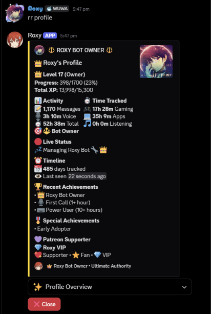
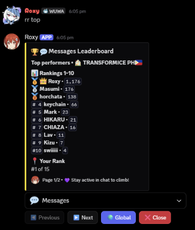
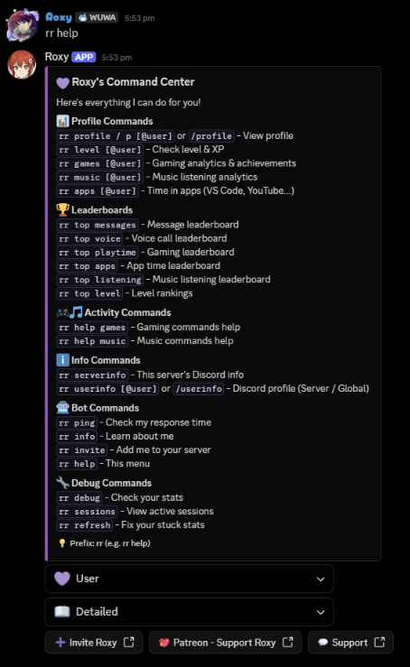

# Roxy 💜

**A Discord stats bot that turns server activity into levels, profiles and leaderboards — automatically.**

Roxy tracks what members do on Discord (chatting, voice calls, gaming, apps and Spotify listening) and turns it into XP, levels, achievements and leaderboards. There's nothing to sign up for: once Roxy joins a server, she reads the activity Discord already shares and starts counting.

Roxy is live in 20+ servers with 1,600+ members.

> This repository is a portfolio copy of the bot's source code. Running your own copy needs a Discord bot token (see [Running it locally](#running-it-locally)).

## Screenshots

<table>
  <tr>
    <th>Profile</th>
    <th>Leaderboard</th>
    <th>Command center</th>
  </tr>
  <tr>
    <td valign="top"></td>
    <td valign="top"></td>
    <td valign="top"></td>
  </tr>
</table>

---

## Features

### 📊 Activity tracking
| What | How it's tracked |
|---|---|
| 💬 Messages | Counted per member — message **content is never stored** |
| 🎙️ Voice | Time in voice channels; switching channels continues the same call |
| 🎮 Gaming | Sessions from Discord's "Playing" status, per game |
| 💻 Apps | Non-game apps (VS Code, YouTube, Netflix…) tracked separately from gaming |
| 🎵 Listening | Spotify sessions with song, artist and album |

Sessions survive restarts: open sessions are discarded on startup (their end time is unknown), and members who are already playing or in a call are picked up again when Roxy reconnects.

### ⭐ XP and levels
| Activity | XP |
|---|---|
| Voice | 25 per active minute |
| Messages | 5 per minute (at most once a minute — spam doesn't farm XP) |
| Gaming / Apps | 1 per minute |
| Listening | 1 per 2 minutes |

- Levels grow progressively: reaching level *N* takes `(N − 1) × N × 50` total XP.
- **Fair voice XP:** checked every minute, and only counts while a member is talking with someone — not alone, muted, deafened or in the AFK channel.
- **Anti-abuse:** single sessions are capped at 24 hours, and duplicate presence events (Discord sends one per shared server) are de-duplicated in memory.
- **Supporter boosts:** Patreon tiers get ×1.25 or ×1.5 XP, detected from roles in the support server.

### 🧭 Interactive menus
Built with Discord's components (dropdowns, buttons and pagination) instead of walls of text:
- **Profiles** with ten views: overview, level, gaming, apps, music, favourites and full history
- **Leaderboards** for messages, voice, playtime, apps, listening and level, per server or global
- **Live sessions:** who is gaming, in voice, using apps or listening right now
- **Discord profile info:** badges, avatar decoration, nameplate, banner and name style, read from the raw API where discord.py doesn't parse them yet
- **Achievements:** 54 achievements across 7 categories

### 🛡️ Roles and permissions
| Role | Who | Can |
|---|---|---|
| 👤 User | everyone | profiles, leaderboards, info |
| 🛡️ Server Admin | members with Administrator, plus the server owner | edit the welcome message, post announcements — in their own server only |
| 👑 Owner | the bot's owner | user management, achievements, database tools, cross-server views |

Every menu checks who pressed it, so nobody can click through someone else's menu or reach owner tools.

### 🔒 Privacy
- Message **content is never stored or logged**; only counts are kept.
- A public [Privacy Policy](PRIVACY.md) and [Terms of Service](TERMS.md).
- Data deletion on request (`rr deleteuser`).
- Owner-only database exports guard against spreadsheet formula injection and keep 18-digit Discord IDs exact.

---

## Tech stack
- **Python 3.13** with **discord.py 2.5** (prefix, slash and hybrid commands, Views, Select menus)
- **SQLite** through **aiosqlite** for fully async database access
- **openpyxl** for Excel exports
- Runs 24/7 on Windows with an auto-restart script, a single-instance lock and log rotation

## Project structure
```
roxy.py          Bot setup, presence and voice tracking, background tasks, help menu
config.py        Owner ID, link buttons, server-admin checks, non-game app list
database.py      SQLite schema and all queries: sessions, XP, leaderboards, settings
patreon.py       Supporter tiers, XP boosts and badges
info_embeds.py   Shared embeds: server and profile info, welcome message
cogs/stats.py    Profiles, levels, leaderboards, sessions, user info
cogs/admin.py    Owner and server-admin commands, achievements, statistics, exports
```

## Engineering highlights
Problems solved while building Roxy:
- **Data integrity:** found and fixed stuck sessions that had added 57,000+ fake hours, removed 269 duplicate sessions, then recalculated every member's XP from the cleaned data, with backups and dry runs first.
- **Concurrency:** Discord sends one presence event per shared server. Comparing against in-memory state, updated before any `await`, stops duplicate sessions from starting.
- **Reliability:** crash recovery for open sessions, a single-instance lock (two copies used to double every reply), safe shutdown that saves active sessions, and a hot reload that also reloads the shared modules.
- **Discord limits:** text is shortened to fit embed limits (1,024 per field, 4,096 per description), names are escaped so `_` and `*` don't break formatting, and long lists are paginated.

## Running it locally
1. Install Python 3.13 and create a virtual environment.
2. `pip install -r requirements.txt`
3. Copy `.env.example` to `.env` and fill in your bot token (`DISCORD_TOKEN`) and your Discord user ID (`ADMIN_USER_ID`).
4. In the Discord Developer Portal, enable the **Presence**, **Server Members** and **Message Content** intents.
5. `python roxy.py`, then type `rr help` in your server.

## Commands at a glance
| Command | What it does |
|---|---|
| `rr help` | Command center, with User / Admin / Owner pages and Detailed / Compact modes |
| `rr profile` · `/profile` | Roxy profile with all views |
| `rr level` · `rr games` · `rr music` · `rr apps` | Focused stats |
| `rr top <category>` | Leaderboards |
| `rr sessions` | What's happening right now |
| `rr userinfo` · `/userinfo` | Discord profile info |
| `rr serverinfo` | Server info |
| `rr welcome` | Welcome message settings (server admins) |
